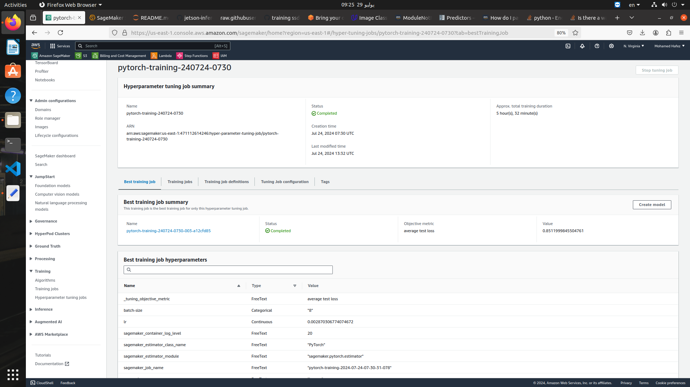

# Image Classification using AWS SageMaker

Use AWS Sagemaker to train a pretrained model that can perform image classification by using the Sagemaker profiling, debugger, hyperparameter tuning and other good ML engineering practices. This can be done on either the provided dog breed classication data set or one of your choice.

## Project Set Up and Installation
Enter AWS through the gateway in the course and open SageMaker Studio. 
Download the starter files.
Download/Make the dataset available. 

## Dataset
The provided dataset is the dogbreed classification dataset which can be found in the classroom.
The project is designed to be dataset independent so if there is a dataset that is more interesting or relevant to your work, you are welcome to use it to complete the project.

### Access
Upload the data to an S3 bucket through the AWS Gateway so that SageMaker has access to the data. 

## Hyperparameter Tuning
What kind of model did you choose for this experiment and why? Give an overview of the types of parameters and their ranges used for the hyperparameter search

Remember that your README should:
- Include a screenshot of completed training jobs
- Logs metrics during the training process
- Tune at least two hyperparameters
- Retrieve the best best hyperparameters from all your training jobs

I used a pretrained effecientnet b2 model and finetuned that on the dogbreed classification dataset. I changed the head of the model (classifier) to be suitable for the number of classes of this dataset (133) and added proper preprocessing using torchvision. The preprocessing included normalization and standardization of the dataset using mean and std values that I calculated from the dataset. In hyperparamer tuning, I tuned the learning rate and the batch size of the model. I used small values for the batch size choices because the training kept throwing cuda_out_of_memory error when I used batch sizes like 256 and 128. The best hyperparameters I found after tuning 4 trials are **lr = 0.002870306774074672 and batch size = 8.** Find below screenshots of the completed hyperparameter tuning job. 





## Debugging and Profiling
**TODO**: Give an overview of how you performed model debugging and profiling in Sagemaker
I used sagemaker's DebuggerHookConfig class to configure the debugger in the notebook. Moreover, I added the loss calculated during training and validation to the loss group to be tracked by sagemaker debugger. 
For the profiler, I used ProfilerConfig class from Sagemaker and passed the configuration to the pytorch estimator class. After training, I was able to grab the estimator report from S3 bucket and display it in the notebook as html file. 

### Results
**TODO**: What are the results/insights did you get by profiling/debugging your model?
The debugger showed that my model has a vanishing gradient problem in addition to overtraining, this means that I need to reduce the model size as this can be related to overfitting. 

Profiling report showed that the GPUs of the instance I used are under utilized, recommendinding I uncrease the batch size or choose a smaller instance. 

**TODO** Remember to provide the profiler html/pdf file in your submission.


## Model Deployment
**TODO**: Give an overview of the deployed model and instructions on how to query the endpoint with a sample input.

The deployed model is an effecientnet b2 model. To query the model, you need to send the image as a base64 encoded string. To handle incoming requests I implemented a custom predictor class that loads the model and applies inference with the proper torchvision transforms returning only the class number of the predicted label. 

Here is a sample code to inquire the model endpoint from the predictor class 
```python 
import base64
with open("./dogImages/test/009.American_water_spaniel/American_water_spaniel_00646.jpg", "rb") as f:
    image = f.read()
    convert = base64.b64encode(image)  # TODO: Your code to load and preprocess image to send to endpoint for prediction

response = predictor.predict(convert)
```

**TODO** Remember to provide a screenshot of the deployed active endpoint in Sagemaker.


## Standout Suggestions
**TODO (Optional):** This is where you can provide information about any standout suggestions that you have attempted.
